# AeroGuard architecture through Day 5

```mermaid
flowchart LR
    A["NASA C-MAPSS ZIP"] --> B["Download + SHA-256 manifest"]
    B --> C["FD001 train, test and truth files"]
    C --> D["Schema and business-rule validation"]
    D --> E["RUL target construction"]
    E --> F["Labeled CSV datasets"]
    E --> G["Statistical summaries"]
    G --> H["Reproducible PNG visualizations"]
    F --> I["Group split by engine ID"]
    I --> J["80 training engines"]
    I --> K["20 validation engines"]
    J --> L["Mean, Ridge, Random Forest, XGBoost"]
    K --> M["Validation metrics"]
    L --> M
    M --> N["Champion selected by validation RMSE"]
    N --> O["Refit on all 100 training engines"]
    O --> P["One final evaluation on 100 test endpoints"]
    L --> Q["MLflow SQLite experiment store"]
    N --> R["Persisted champion model + metadata"]
    J --> S["Fit scaler on training engines only"]
    S --> T["30-cycle sliding sequences"]
    K --> U["Validation sequences transformed with training scaler"]
    T --> V["Two-layer PyTorch LSTM"]
    U --> V
    V --> W["Early stopping by validation RMSE"]
    W --> X["Refit for selected epochs on all training engines"]
    X --> Y["Official test: one final sequence per engine"]
    R --> Z["TreeSHAP global + local explanations"]
    W --> AA["Validation accuracy winner: LSTM"]
    P --> AB["Operational-risk review"]
    Y --> AB
    Z --> AB
    AB --> AC["Current deployment champion: Random Forest"]
    AC --> AD["Recompute engine RUL + local SHAP evidence"]
    AE["Project-authored reliability handbook"] --> AF["Heading-based chunks + SHA-256 fingerprints"]
    AF --> AG["TF-IDF unigram/bigram index"]
    AD --> AH["Evidence-aware retrieval query"]
    AG --> AH
    AH --> AI["Top-k cited sections"]
    AD --> AJ["Grounded structured generator"]
    AI --> AJ
    AJ --> AK["Protected-field + citation validation"]
    AK --> AL["Auditable reliability brief"]
    AM["8 labeled retrieval questions"] --> AN["Hit@3 + MRR evaluation"]
    AG --> AN
    AL --> AO["FastAPI service layer"]
    P --> AO
    Y --> AO
    Z --> AO
    AN --> AO
    AO --> AP["Validated JSON endpoints"]
    AP --> AQ["Responsive operations dashboard"]
    AQ --> AR["Fleet queue + engine drill-down"]
    AS["GitHub Actions"] --> AT["Automated unit + API tests"]
    AU["Render blueprint"] --> AV["Health-checked Uvicorn service"]
```

## Why this is a pipeline instead of a notebook

A notebook is useful for exploration, but hidden execution order makes it difficult to test and reproduce. AeroGuard keeps production logic in small Python modules. The command-line runner calls them in a fixed order, automated tests exercise them independently, and future notebooks or dashboards can import the same functions.

## Boundaries

- Raw files are immutable inputs.
- Validation runs before labels or statistics are generated.
- Processed files are derived artifacts and can always be rebuilt.
- Reports describe the training population; they are not model-performance claims.
- Day 2 and Day 3 model selection never uses the official test set.
- The persisted model accepts the same ordered feature columns recorded in its metadata.
- A Day 3 sequence never crosses an engine boundary and uses only current and earlier cycles.
- The validation scaler is fitted on training engines only; the final scaler is fitted on all training engines only.
- SHAP explanations are explicitly attached to Random Forest predictions and are not presented as LSTM explanations.
- Retrieved text is treated as untrusted reference data and receives no authority to alter system rules.
- The generator cannot alter authoritative engine ID, risk band, or RUL fields; code restores them after generation.
- Citations are restricted to the retrieved chunk allowlist.
- The API returns 503 when a required artifact is missing instead of using mock data.
- Every dashboard number is obtained through the API rather than hardcoded in the browser.
- Official test RUL is benchmark context only and would be unknown in a live fleet.
- Cloud configuration is a blueprint and is not represented as an already deployed service.

## Model and explanation boundary

The numerical RUL estimate is produced by a trained regression model. MLflow records the parameters and metrics used to reach that decision. TreeSHAP explains Random Forest predictions as a baseline plus feature contributions; it does not explain the LSTM and it does not prove physical causation. A future RAG layer may retrieve reliability documents, but neither RAG nor an LLM is allowed to alter the numerical prediction.

## Day 3 promotion boundary

Validation RMSE identifies the LSTM as the accuracy winner without consulting the official test set. Deployment promotion is a later governance gate, not a second hyperparameter search. The Random Forest remains the current deployment champion because it has the better official-test late-warning-sensitive NASA score and direct TreeSHAP support. The LSTM checkpoint is retained for further risk analysis.

## Day 4 RAG boundary

The knowledge base contains project-authored demonstration guidance, not an approved maintenance manual. The local retriever is a deterministic TF-IDF baseline. A structured generator may summarize only the verified model packet and retrieved chunks. The offline generator is the default; an optional OpenAI Responses API provider requires an explicit environment setting and API key. In both modes, deterministic validation protects numerical fields and citation integrity. Final operational authority remains with qualified humans.

## Day 5 serving boundary

FastAPI is a thin delivery layer over reusable service functions. It validates inputs, translates domain failures into HTTP status codes, constrains CORS, adds request IDs and exposes OpenAPI documentation. The service reads persisted Day 1-4 artifacts rather than retraining for each request. The static dashboard is served by the same process and requests only real API data.

The current artifact files suit a portfolio-scale demonstration. At production scale, offline training would publish an approved, versioned model to object storage or a registry. Stateless inference replicas would load it, while a database or feature store would replace local CSV reports. Authentication, rate limiting, centralized logs, drift monitoring and maintenance-outcome feedback would be mandatory.
